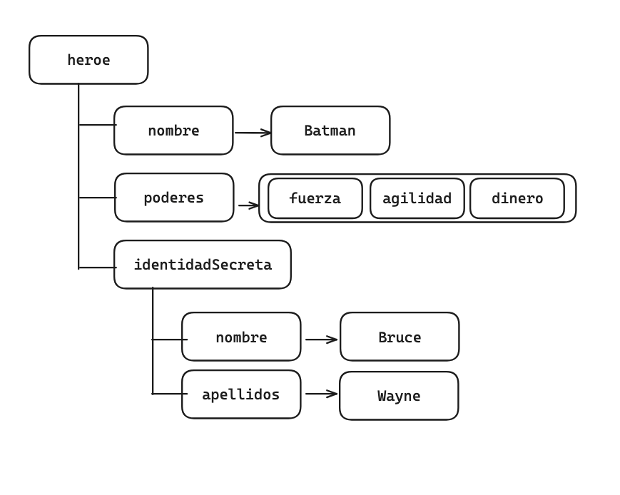
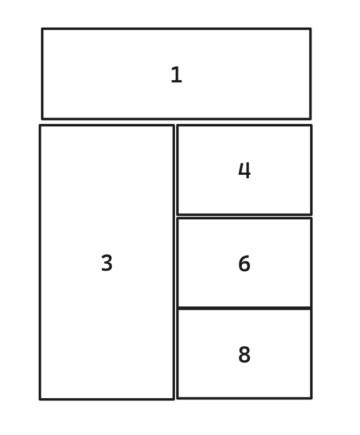
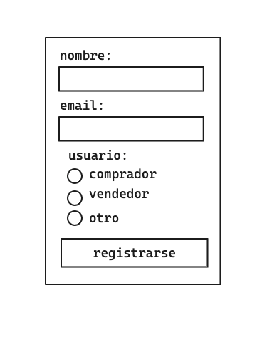

# Examen UT1 : Lenguajes de marcas

## 1. XML

En el fichero `heroe.xml`, pasar la estructura de la siguiente imagen a XML teniendo en cuenta:
1. Nombres de propiedades [1pt]
2. Propiedades compuestas [1pt]
3. Listas [1pt]

## 2.HTML

Partiendo del fichero `web.html`:

1. Cambia el nombre de la pestaña del navegador a `UT1: LLMM` [0.5pt]
2. Añade un encabezado o título (el más importante): `UT1: Examen de Lenguajes de marcas` [0.5pt]
3. Añade párrafo con: `Este es el examen de la unidad 1 del módulo de desarrollo web en entorno cliente` [0.5pt]

4. Una tabla [1.5pt]

5. El siguiente formulario: [1.5pt]
Para el botón usar un elemento `button`

## 3.CSS
Vincula el fichero `style.css` y haz lo siguiente:
1. Las celdas 4 y 8 de la tabla: [0.5pt]
    - color de fondo: rgb(118, 186, 138)

2. Las celdas 3 y 8 de la tabla: [0.5pt]
    - color: rgb(108, 26, 230)
    - peso de la fuente: 900

1. El botón del formulario tiene que tener: [1pt]
    - margen interior vertical: 8px
    - margen interior lateral: 12px
    - color de fondo: rgb(118, 186, 138)
    - borde de 2px tipo sólido

